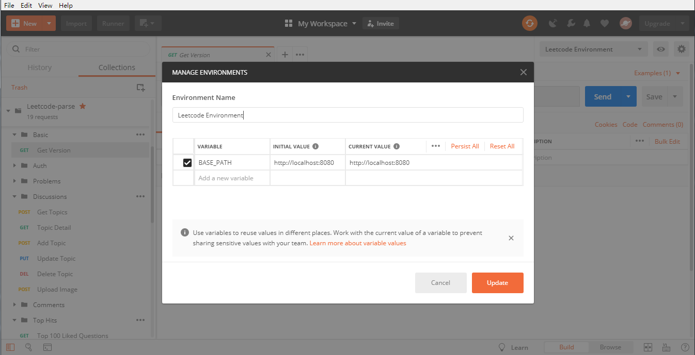
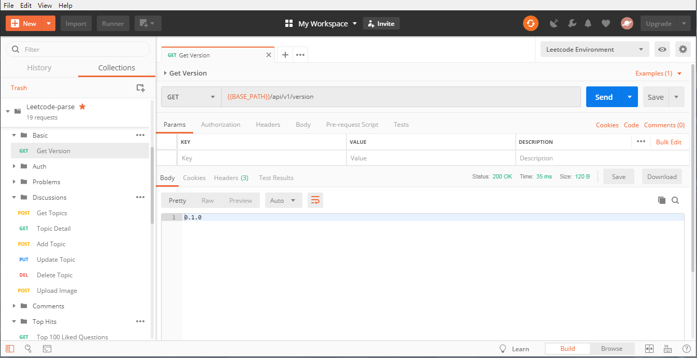
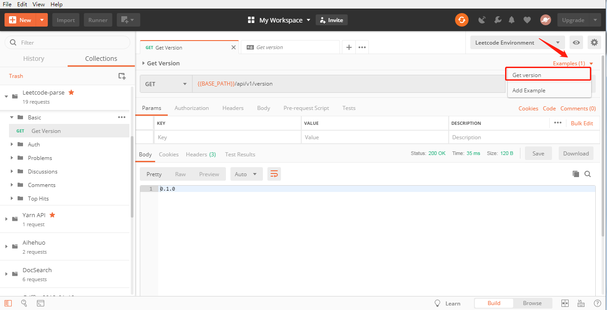

<!--
Licensed to the Apache Software Foundation (ASF) under one
or more contributor license agreements.  See the NOTICE file
distributed with this work for additional information
regarding copyright ownership.  The ASF licenses this file
to you under the Apache License, Version 2.0 (the
"License"); you may not use this file except in compliance
with the License.  You may obtain a copy of the License at

  http://www.apache.org/licenses/LICENSE-2.0

Unless required by applicable law or agreed to in writing,
software distributed under the License is distributed on an
"AS IS" BASIS, WITHOUT WARRANTIES OR CONDITIONS OF ANY
KIND, either express or implied.  See the License for the
specific language governing permissions and limitations
under the License.
-->

# Postman Guide
- You can try leetcode-parse APIs by using any http client, here we use [postman](https://github.com/postmanlabs/postman-app-support) as example.
We have prepared two postman configuration files, you can download them from [json files](../postman).  For sake of usage, you need to import two files into postman firstly.  
  
And change the initial environment `BASE_PATH` value to `<your local IP address>:8080`.  
  
-  You can try the api `Basic -> Get griffin version`, to make sure leetcode-parse service has started up.  
  

- View request example
  
  
